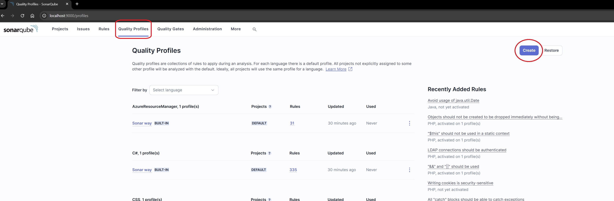
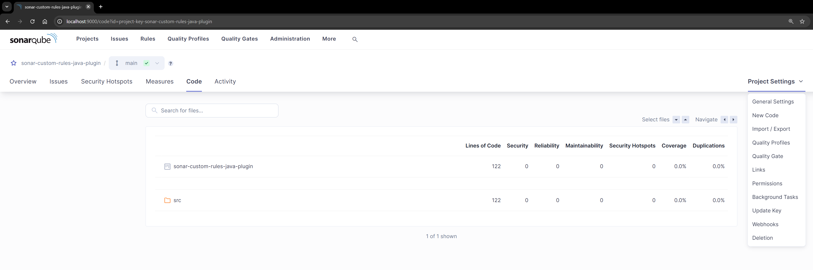

# ISSUES: Sonarqube is not pointing out custom rules issues in the analysis

## Configure the Gradle Task *sonarqube*

To configure the Gradle task *sonarqube*, follow this tutorial: [Click here to access the tutorial](README.md#sonarqube-configuration). Once configured, run:

```bash
./gradlew sonarqube
```

## Create a Quality Profile

Access `http://localhost:9000` and log in to your SonarQube account. Once logged in, go to the **Quality Profiles** tab and click the **Create** button.



Fill in the required input fields as shown in the image above, then click the **Create** button.


Next, click on the **xxx inactive rules** link in the profile you just created.


Search for `AvoidOldDateApi` and click the **Activate** button.


A confirmation dialog will appear. Click the **Activate** button to proceed.


Here's the revised and improved text:


Navigate to the **Projects** tab and click on the link for your project, **sonar-custom-rules-java-plugin**.


>If your project does not appear, run the following command to ensure it is analyzed:
>
>```bash
>./gradlew sonarqube
>```


Expand the project settings by clicking on the settings icon, then select **Quality Profiles**.


Click on the edit icon to configure the quality profile.


Select the quality profile you just created and click the **Save** button.


You should now see an increase in the number of active rules.


Note that there are no issues reported in the project.


Even though there is non-compliant code in the project, SonarQube does not highlight it.


However, SonarLint successfully detects and points out the issue.


I selected all permissions and regenerated the token, but the issue persisted.




