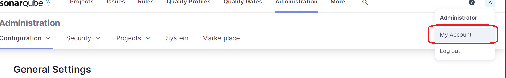
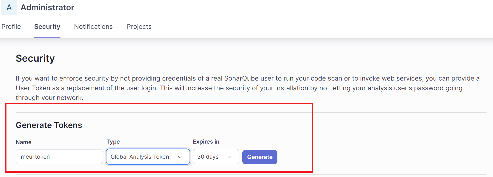
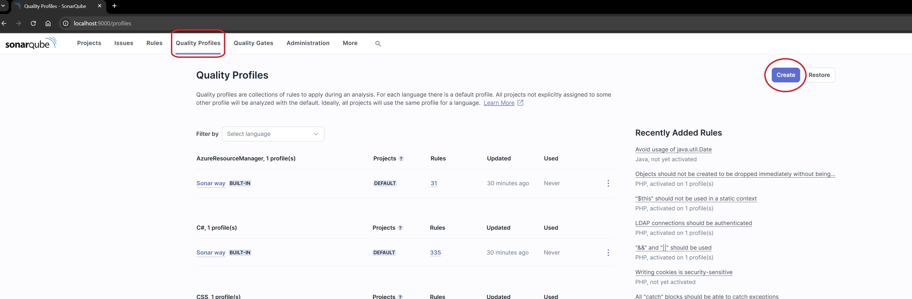

# Sonar Custom Rules Java Plugin

This project is a custom SonarQube plugin containing rules for analyzing Java code.

## Requirements

- **JDK 17** (Configured in `build.gradle`)
- **Gradle 7.x** or higher
- **SonarQube 10.6.0.2114** (or a compatible version with the plugin API)

## Project Setup

### Cloning the Repository

```bash
git clone https://github.com/helbertvieirarios/sonar-custom-rules-java-plugin.git
cd sonar-custom-rules-java-plugin
```

### Building and Generating the JAR

To compile the project and generate a JAR with all dependencies (fat JAR), use:

```bash
./gradlew shadowJar
```

The generated JAR will be located in the `build/libs/` folder.

### Running Tests

To run the tests, execute:

```bash
./gradlew test
```

### Publishing to Maven Repository

To publish the JAR to the local Maven repository, use:

```bash
./gradlew publishToMavenLocal
```

## Installing the Plugin

To set up the SonarQube server, run:

```bash
docker run --name sonarqube -p 9000:9000 sonarqube:10.7.0-community
```
The userame and password are: *admin* 

To generate the JAR file:

```bash
./gradlew clean build shadowJar
```

Copy the JAR to the SonarQube container and restart it:

```bash
docker cp build/libs/sonar-custom-rules-java-plugin-1.0-SNAPSHOT.jar sonarqube:/opt/sonarqube/extensions/plugins && \
docker restart sonarqube
```

*To remove it, use:*

```bash
docker exec sonarqube rm /opt/sonarqube/extensions/plugins/sonar-custom-rules-java-plugin-1.0-SNAPSHOT.jar
```

## SonarQube Configuration

To run the SonarQube analysis, you must first ensure that SonarQube is up and running and that you have the correct access token configured.

### Step 1: Create an Access Token

To interact with SonarQube and enable certain operations, you need to create an access token.

#### Navigate to Your Account

Access `http://localhost:9000` and log in to your SonarQube account. Once logged in, select **My Account**:




#### Create a Token

Navigate to the **Security** tab, fill in the required information, such as the token name and permissions, and click **Generate** to create the token.



Ensure you copy and securely store this token, as it will only be displayed once.

### Step 2: Add the Token to `build.gradle`

After generating the token, add it to your `build.gradle` file in the `sonar.login` property to authenticate SonarQube analyses:

```groovy
sonarqube {
    properties {
        property "sonar.projectKey", "project-key-sonar-custom-rules-java-plugin"
        property "sonar.host.url", "http://localhost:9000"
        property "sonar.token", "<your-generated-token>" // Replace with your generated token
        property "sonar.scm.disabled", "true"
        property "sonar.profile", "profile-sonar-custom-rules-java-plugin"
        property "sonar.sources", "src/main/java"
        property "sonar.tests", "src/test/java"
        property "sonar.inclusions", "**/*.java"
    }
}
```

### SonarQube Configuration

To run the SonarQube analysis, ensure that SonarQube is up and running and that you have the correct credentials. Run:

```bash
./gradlew sonarqube
```

### Important Properties

The project uses the following SonarQube property configurations:

- **sonar.projectKey**: `project-key-sonar-custom-rules-java-plugin`
- **sonar.host.url**: `http://localhost:9000`
- **sonar.token**: `<user token>`
- **sonar.profile**: `profile-sonar-custom-rules-java-plugin`

Make sure to replace the `sonar.login` value with the appropriate authentication token for your SonarQube environment.

## Dependencies

The main dependencies of the project include:

- `org.sonarsource.api.plugin:sonar-plugin-api:10.6.0.2114`
- `org.sonarsource.java:sonar-java-plugin:8.5.0.37199`
- `com.google.guava:guava:19.0`
- `org.mockito:mockito-core:5.5.0`
- `org.junit.jupiter:junit-jupiter-api:5.10.0`

## Project Structure

- `src/main/java` – Main plugin source code
- `src/test/java` – Unit tests for the custom rules
- `build.gradle` – Gradle configuration file

## Contribution

Contributions are welcome! Follow these steps:

1. Fork the project.
2. Create a branch (`git checkout -b feature/new-feature`).
3. Make your changes and commit them (`git commit -m 'Add new feature'`).
4. Push your changes (`git push origin feature/new-feature`).
5. Open a Pull Request.


## License

This project is licensed under the GNU General Public License v3. For more details, see the [LICENSE](link-to-license-file) file or visit [GNU GPL v3](https://www.gnu.org/licenses/gpl-3.0.en.html).

## Author

- [Helbert Vieira Rios](https://github.com/helbertvieirarios)


## Issue 

Configure the gradlew classe

### Create a profile
